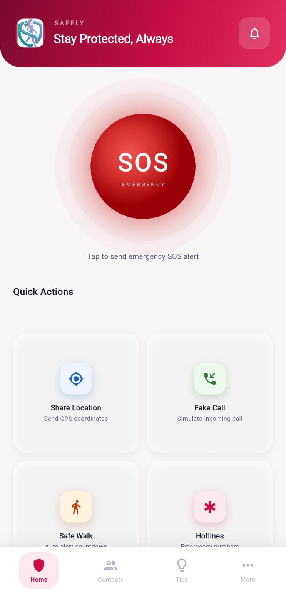
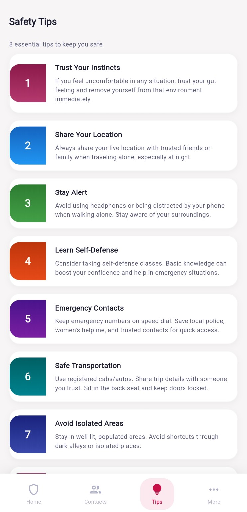
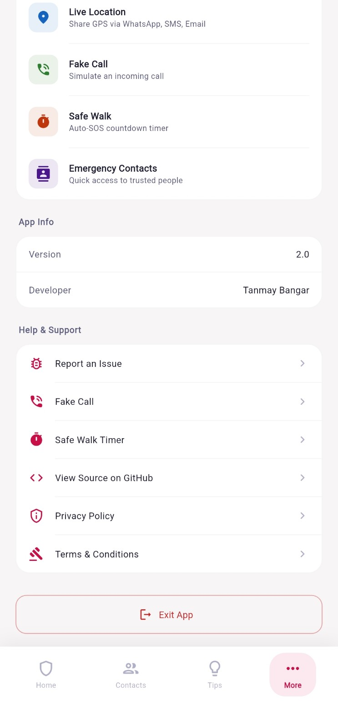
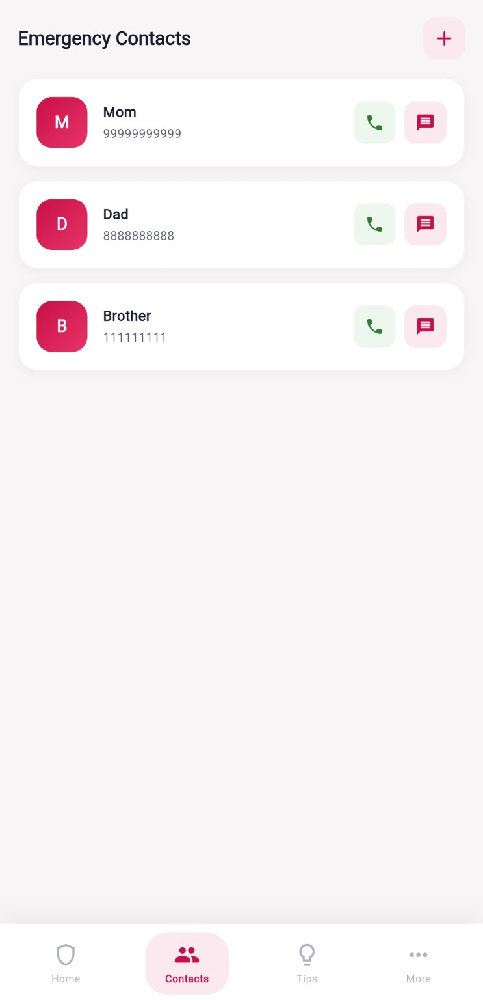

# Safely — Women's Safety App

> A personal safety companion for women — built with Flutter for Android.

[](https://flutter.dev)
[](https://developer.android.com)
[](https://github.com/t0nyb17)
[](LICENSE)

## ⬇️ Download

**[Safely-v2.0.apk](./Safely-v2.0.apk)** — 45.6 MB · Android 6.0+ (API 23+) · All architectures (arm64, arm32, x86_64)

> Enable **"Install from unknown sources"** in your Android settings before installing.

---

## What is Safely?

**Safely** is a women's personal safety app that puts emergency tools one tap away. Whether you're walking alone at night, in an uncomfortable situation, or genuinely in danger — Safely lets you alert your trusted contacts instantly with your live GPS location, simulate an incoming call, or set a safety timer that auto-triggers an SOS if you don't check in.

Designed to be fast, offline-capable for core features, and work without relying on a backend server.

---

## Features

### 🆘 SOS Alert
The centerpiece of the app. A single tap on the large SOS button:
1. Fetches your live GPS coordinates
2. Sends an emergency SMS directly to **all saved contacts** (no dialog, using Android SmsManager)
3. Opens WhatsApp with a pre-filled SOS message + location link to your first contact
4. Directly calls your first emergency contact (no dialer popup)

All three happen simultaneously, maximising the chance someone gets the alert.

### 📍 Share Location
Manually share your real-time GPS coordinates anytime via:
- **WhatsApp** — pre-filled message with Google Maps link
- **SMS** — to any number
- **Email** — with coordinates in body

### 📞 Fake Call
Simulates a realistic incoming phone call to help you exit an uncomfortable or unsafe situation discreetly.
- Choose the caller name (Mom, Dad, Friend, Work, etc.)
- Authentic dark call UI with expanding pulse rings
- Full in-call screen with Mute, Keypad, and Speaker controls
- Haptic vibration to make it feel real

### ⏱ Safe Walk
Set a countdown timer before you start walking somewhere alone.
- Choose durations: 5, 10, 15, 30, or 60 minutes
- Tap **"I'm Safe"** to reset and extend the timer
- If the timer reaches zero without a check-in, SOS is automatically triggered

### 👥 Emergency Contacts
Manage a list of trusted people who receive alerts.
- Add contacts with name and phone number
- Swipe left to delete
- Quick **call** and **SMS** buttons on every contact card
- All contacts stored locally on-device (no cloud sync)

### 📋 Emergency Hotlines
A built-in directory of national emergency numbers with direct call shortcuts.

### 💡 Safety Tips
Curated, actionable safety tips for everyday situations — organised and easy to read.

### 🐛 Report / Feedback
Submit a bug report or feature request directly from the app. Tapping Submit opens your email client pre-filled to the developer.

---

## Tech Stack

| Package | Purpose |
|---|---|
| `flutter` | UI framework (Material 3) |
| `geolocator ^10.1.0` | GPS location access |
| `telephony ^0.2.0` | Direct SMS via Android SmsManager (no user dialog) |
| `flutter_phone_direct_caller ^2.1.1` | Initiate calls without opening the dialer |
| `url_launcher ^6.1.14` | WhatsApp, email, SMS fallback, tel: links |
| `permission_handler ^11.0.1` | Runtime permission requests |

**Dart SDK:** ≥ 2.19.0
**Min Android SDK:** API 23 (Android 6.0)
**Target Android SDK:** API 34 (Android 14)

---

## Project Structure

```
lib/
├── main.dart                  # App entry point
├── screens/
│   ├── main_screen.dart       # Bottom nav shell
│   ├── home_screen.dart       # SOS + quick actions
│   ├── contacts_screen.dart   # Emergency contacts list
│   ├── safety_tips_screen.dart
│   ├── more_screen.dart       # Profile / settings
│   ├── fake_call_screen.dart  # Fake incoming call UI
│   ├── safe_walk_screen.dart  # Countdown timer
│   └── report_screen.dart     # Feedback form
├── services/
│   ├── alert_service.dart     # SOS logic (SMS + WhatsApp + call)
│   └── location_service.dart  # GPS + sharing
├── widgets/
│   ├── sos_button.dart        # Animated SOS button
│   ├── contact_card.dart      # Swipeable contact tile
│   ├── safety_tip_card.dart   # Tip card with gradient accent
│   └── action_button.dart     # Reusable list-style button
├── models/
│   ├── contact.dart
│   ├── emergency_number.dart
│   └── safety_tip.dart
├── data/
│   ├── emergency_numbers_data.dart
│   └── safety_tips_data.dart
└── utils/
    ├── colors.dart            # App colour palette
    └── constants.dart         # Shared constants & messages
```

---

## Getting Started

### Prerequisites
- Flutter SDK ≥ 2.19.0 ([install guide](https://docs.flutter.dev/get-started/install))
- Android Studio or VS Code with Flutter extension
- Android device (API 23+) or emulator with USB debugging enabled

### Run Locally

```bash
git clone https://github.com/t0nyb17/safely.git
cd safely
flutter pub get
flutter run
```

### Build Release APK

```bash
flutter build apk --release
# Output: build/app/outputs/flutter-apk/app-release.apk
```

---

## Android Permissions

| Permission | Why it's needed |
|---|---|
| `ACCESS_FINE_LOCATION` | Precise GPS for SOS location message |
| `SEND_SMS` | Send emergency SMS directly without user confirmation |
| `CALL_PHONE` | Place emergency call without opening the dialer |
| `READ_PHONE_STATE` | Required by telephony package |
| `VIBRATE` | Haptic feedback on fake call screen |
| `INTERNET` | URL launcher for WhatsApp and email |

> **Note:** `SEND_SMS` and `CALL_PHONE` are sensitive permissions — the app requests them at runtime on first SOS use.

---

## How SOS Works (Under the Hood)

```
User taps SOS
      │
      ├─► Get GPS coordinates (geolocator)
      │
      ├─► Send SMS to all contacts (telephony / SmsManager)
      │         Message: "EMERGENCY SOS! I need help!
      │                   Location: https://maps.google.com/?q=lat,lng"
      │
      ├─► Open WhatsApp to contact[0] with same message
      │
      └─► Direct call to contact[0] (flutter_phone_direct_caller)
```

---

## Known Limitations

- **iOS not supported** — `telephony` and `flutter_phone_direct_caller` are Android-only
- **`telephony` package is discontinued** — works but requires a [namespace patch](android/app/build.gradle.kts) for newer Gradle versions
- SMS delivery depends on network coverage and carrier restrictions
- Location accuracy depends on device GPS hardware

---

## Version History

### v1.0 — Initial Release

> .png)

Basic SOS alert, emergency contacts, live location sharing, and safety tips.

---

### v2.0 — Current · [Download APK](./Safely-v2.0.apk)

>    

New brand identity (Safely), custom logo, redesigned UI with #C90F47 theme, authentic fake call screen, Safe Walk timer, and in-app feedback with email reporting.

---

## Developer

**Tanmay Bangar**
GitHub: [@t0nyb17](https://github.com/t0nyb17)

---

## License

This project is intended for personal and educational use.
